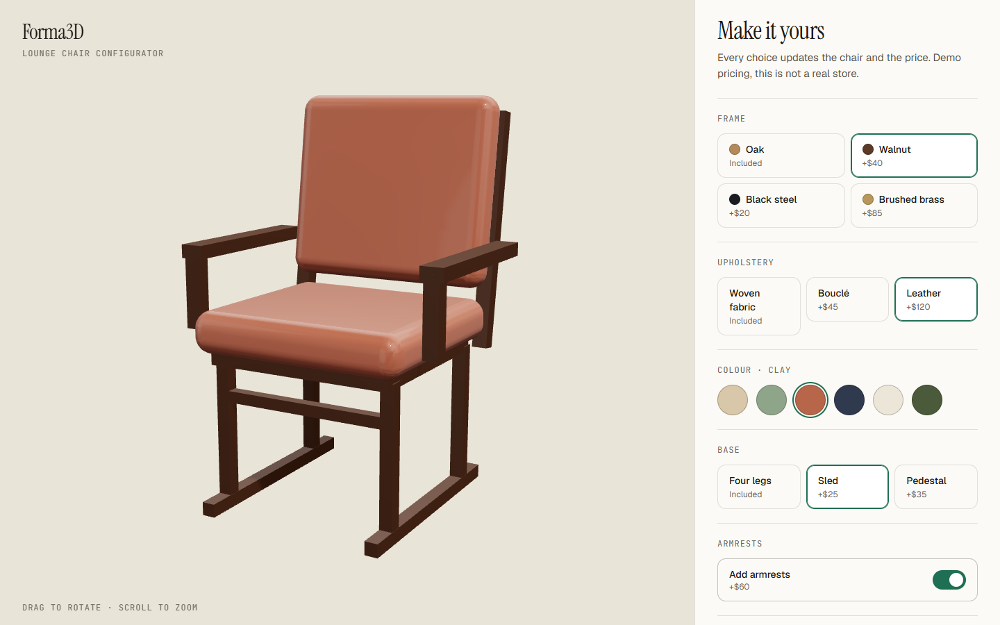
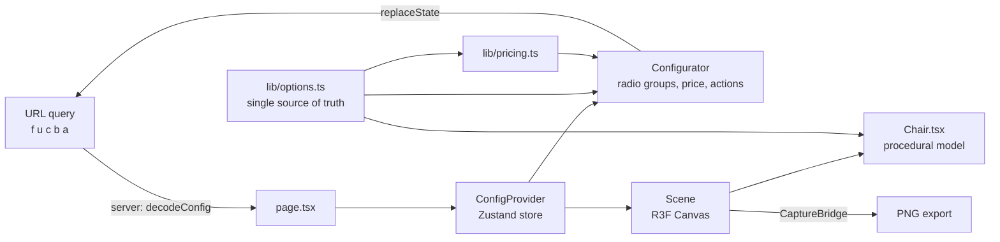

# Forma3D: 3D product configurator

[](https://github.com/Waleed-Ilyas/forma3d/actions/workflows/ci.yml)


Configure a lounge chair in 3D: pick frame, upholstery, colour, base and armrests, watch the price update, share the exact configuration as a link, or save a PNG of it.

**Live demo:** https://forma3d-iota.vercel.app · **Personal project.** The prices are demo numbers, this is not a real store.



## Demo accounts

None. There is no login, the app is fully public.

## Features

- **Live 3D chair** modelled entirely in code from primitives (rounded boxes, cylinders), so there are no model files to download.
- **Eased materials:** colour, roughness, metalness and sheen glide to the new value instead of snapping.
- **Live itemised price** where the total is always the sum of the lines shown.
- **Shareable URL:** the address bar always holds the current configuration (`?f=walnut&u=leather&c=clay&b=sled&a=1`). The server reads it, so a shared link renders correctly on first paint with no flash of defaults.
- **PNG export** of the current view.
- **Studio lighting from light panels** (no HDR download), soft contact shadow, orbit controls with auto-rotate that stops on first touch and never starts under `prefers-reduced-motion`.
- **Accessible controls:** native radio inputs and a switch, real labels, keyboard navigation, visible focus, price announced through an `aria-live` region.
- **Mobile layout** with the 3D view on top and a sticky price bar.
- **Fallback** when WebGL is unavailable: the options and price still work.

## Tech stack

Next.js 15 (App Router), TypeScript strict, Tailwind CSS v4, three.js, React Three Fiber, drei, Zustand, Zod, Vitest, ESLint, Prettier, GitHub Actions.

## Architecture



`lib/options.ts` is the single source of truth for every choice: the UI, the 3D materials and the pricing all read from it, so adding a finish is a one-line change.

## Getting started

```bash
git clone https://github.com/Waleed-Ilyas/forma3d.git && cd forma3d
pnpm install
pnpm dev        # http://localhost:3000
```

No environment variables are needed.

## Tests

```bash
pnpm test         # pricing rules and share-link encode/decode
pnpm lint && pnpm typecheck
```

## Key engineering decisions

- **Procedural model instead of a downloaded GLB.** It ships instantly, every part can be re-materialled independently, and it removes any licensing question.
- **Config in the URL, decoded on the server.** Sharing is just copying the address, and each field is validated on its own so one bad value falls back to that field's default instead of discarding the whole link.
- **Zustand vanilla store per provider.** It keeps state out of the URL parsing path, works with server-rendered initial values, and avoids a module-level singleton.
- **Materials are created once and eased in `useFrame`.** Defining them as elements rather than inline components avoids remounting them on every change, which would kill the transition.
- **`preserveDrawingBuffer` plus an explicit render before export** so the PNG is a complete frame on every browser.

## What I'd improve next

- A real modelled GLB with baked ambient occlusion, and stitching and piping detail on the cushions.
- Augmented reality preview with `<model-viewer>` and a USDZ/GLB export.
- Dimension callouts and a fit check for the room.
- Persisted saved configurations and a cart handoff, behind auth.
- Visual regression tests with Playwright screenshots of each option.

## Author

Waleed Ilyas, Full Stack Engineer (MERN, Next.js, Solana).
[GitHub](https://github.com/Waleed-Ilyas) · [LinkedIn](https://www.linkedin.com/in/waleed-ilyas-664839213) · waleedilyas99@gmail.com

Released under the [MIT License](LICENSE).
